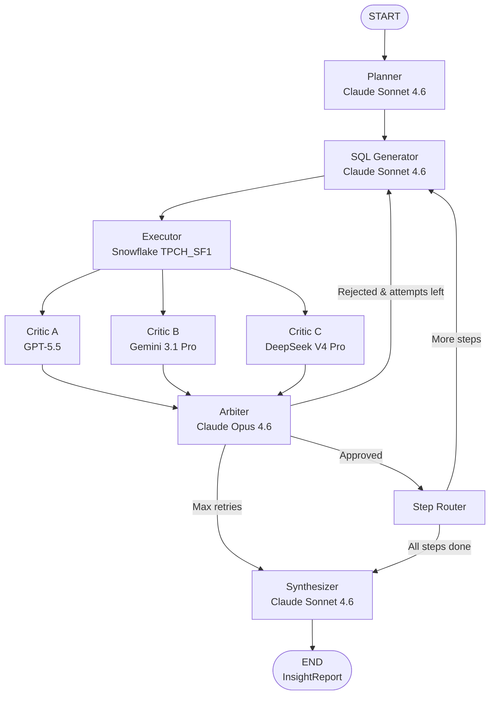

# Quorum — Agentic Data Analyst
## Complete Project Workflow Specification v3
*Portfolio Project | LangGraph + Snowflake + Pydantic + Multi-Model Ensemble Critique*
*Model strings verified: May 2026*

---

## 1. Project Overview

### What It Does
A user types a natural language business question (e.g., "Which customers generated the most revenue last year?"). Quorum plans a multi-step query strategy, generates and validates SQL, executes it against Snowflake's TPCH sample dataset, runs the result through a three-model ensemble critic panel with an arbiter, and returns a structured insight report — all orchestrated by a LangGraph state graph.

### What It Demonstrates
| Technology | Role in This Project |
|---|---|
| **LangGraph** | Multi-node state graph, conditional edges, fan-out/fan-in parallel critic execution, retry loops |
| **Snowflake** | Live warehouse query execution against `SNOWFLAKE_SAMPLE_DATA.TPCH_SF1` |
| **Pydantic v2** | Typed contracts at every node boundary — no untyped dicts anywhere |
| **Multi-Model Ensemble** | Three independent critics from three different companies + Claude Opus arbiter |
| **Async Python** | Parallel critic execution via `asyncio.gather()` |

---

## 2. Model Registry
*All model strings verified current as of May 2026. Do not substitute.*

| Role | Provider | Model String | Notes |
|---|---|---|---|
| Planner, SQL Generator, Synthesizer | Anthropic | `claude-sonnet-4-6` | Primary orchestration nodes |
| **Critic A** | OpenAI | `gpt-5.5-2026-04-23` | Set `reasoning_effort="high"` |
| **Critic B** | Google | `gemini-3.1-pro-preview` | Standard endpoint |
| **Critic C** | DeepSeek (open-weight) | `deepseek-v4-pro` | Via Anthropic SDK format — see Section 7.3 |
| **Arbiter** | Anthropic | `claude-opus-4-6` | Meta-reasoning only — never touches SQL |

### Why This Panel
Each critic comes from a different company with a different training lineage. Claude is removed from the critic panel entirely — it only appears in primary orchestration and the Arbiter. DeepSeek V4 Pro is called via the Anthropic SDK format (base URL `https://api.deepseek.com/anthropic`), eliminating the need for a fourth SDK dependency.

---

## 3. Repository Structure

```
quorum/
├── pyproject.toml
├── .env.example
├── .gitignore
├── AGENTS.md                         ← Codex instruction file
├── README.md
├── quorum/
│   ├── __init__.py
│   ├── graph.py                      ← LangGraph graph assembly
│   ├── state.py                      ← AgentState (Pydantic)
│   ├── schemas/
│   │   ├── __init__.py
│   │   ├── plan.py                   ← QueryStep, QueryPlan
│   │   ├── query.py                  ← ValidatedQuery, QueryResult
│   │   ├── critique.py               ← CritiqueResult, ArbitrationResult
│   │   └── report.py                 ← InsightReport
│   ├── nodes/
│   │   ├── __init__.py
│   │   ├── planner.py
│   │   ├── sql_generator.py
│   │   ├── executor.py
│   │   ├── critic_openai.py          ← Critic A
│   │   ├── critic_gemini.py          ← Critic B
│   │   ├── critic_deepseek.py        ← Critic C
│   │   ├── arbiter.py
│   │   ├── step_router.py
│   │   └── synthesizer.py
│   ├── llm/
│   │   ├── __init__.py
│   │   ├── anthropic_client.py       ← Claude + DeepSeek (dual-endpoint)
│   │   ├── openai_client.py          ← GPT-5.5 only
│   │   └── gemini_client.py          ← Gemini 3.1 Pro Preview only
│   └── tools/
│       ├── __init__.py
│       └── snowflake_client.py
├── prompts/
│   ├── planner.txt
│   ├── sql_generator.txt
│   ├── critic.txt
│   ├── arbiter.txt
│   └── synthesizer.txt
├── app.py                            ← Streamlit UI
└── tests/
    ├── conftest.py
    ├── test_schemas.py
    ├── test_nodes.py
    └── test_graph.py
```

---

## 4. Environment Configuration

### `.env` Variables
```
# Anthropic (Claude primary nodes + Arbiter)
ANTHROPIC_API_KEY=

# OpenAI (GPT-5.5 — Critic A)
OPENAI_API_KEY=

# Google (Gemini 3.1 Pro Preview — Critic B)
GOOGLE_API_KEY=

# DeepSeek (V4 Pro — Critic C, called via Anthropic SDK format)
DEEPSEEK_API_KEY=
DEEPSEEK_BASE_URL=https://api.deepseek.com/anthropic

# Snowflake
SNOWFLAKE_ACCOUNT=
SNOWFLAKE_USER=
SNOWFLAKE_PASSWORD=
SNOWFLAKE_WAREHOUSE=COMPUTE_WH
SNOWFLAKE_DATABASE=SNOWFLAKE_SAMPLE_DATA
SNOWFLAKE_SCHEMA=TPCH_SF1
SNOWFLAKE_ROLE=ACCOUNTADMIN
```

`.env` must be in `.gitignore`. `.env.example` must be committed with all keys present and values blank.

---

## 5. Dependencies (`pyproject.toml`)

```toml
[project]
name = "quorum"
version = "0.1.0"
requires-python = ">=3.11"

dependencies = [
    "anthropic>=0.40.0",
    "openai>=1.75.0",
    "google-genai>=1.0.0",
    "langgraph>=0.2.0",
    "langchain-anthropic>=0.3.0",
    "snowflake-connector-python>=3.12.0",
    "pydantic>=2.0.0",
    "streamlit>=1.40.0",
    "python-dotenv>=1.0.0",
]
```

Note: No `deepseek` SDK required. DeepSeek is called through the `anthropic` SDK via a custom base URL.

---

## 6. Pydantic Schema Definitions

All schemas in `quorum/schemas/`. Every node boundary is typed. No raw dicts cross node boundaries at any point in the graph.

---

### 6.1 AgentState (`quorum/state.py`)

| Field | Type | Default | Description |
|---|---|---|---|
| `question` | `str` | required | Original user question — never mutated |
| `schema_context` | `str` | required | TPCH schema description injected at start |
| `query_plan` | `QueryPlan \| None` | `None` | Output of Planner |
| `current_step_index` | `int` | `0` | Active plan step |
| `validated_query` | `ValidatedQuery \| None` | `None` | Output of SQL Generator |
| `query_result` | `QueryResult \| None` | `None` | Output of Executor |
| `critique_openai` | `CritiqueResult \| None` | `None` | Critic A output |
| `critique_gemini` | `CritiqueResult \| None` | `None` | Critic B output |
| `critique_deepseek` | `CritiqueResult \| None` | `None` | Critic C output |
| `arbitration` | `ArbitrationResult \| None` | `None` | Arbiter output |
| `attempts` | `int` | `0` | SQL attempts for current step |
| `max_attempts` | `int` | `3` | Max retries per step |
| `all_results` | `list[QueryResult]` | `[]` | Approved results across all steps |
| `insight_report` | `InsightReport \| None` | `None` | Final synthesizer output |
| `error_message` | `str \| None` | `None` | Human-readable failure message |
| `status` | `Literal["running","complete","failed"]` | `"running"` | Graph lifecycle |

---

### 6.2 QueryStep and QueryPlan (`schemas/plan.py`)

**QueryStep:**

| Field | Type | Description |
|---|---|---|
| `step_number` | `int` | 1-based sequence |
| `objective` | `str` | Plain English description of what this step retrieves |
| `tables_required` | `list[str]` | TPCH table names needed |
| `expected_columns` | `list[str]` | Column names expected in result |
| `expected_output_description` | `str` | Shape and nature of result set |

**QueryPlan:**

| Field | Type | Description |
|---|---|---|
| `original_question` | `str` | Echo of user question |
| `reasoning` | `str` | Planner's decomposition strategy |
| `steps` | `list[QueryStep]` | Ordered steps — maximum 3 |
| `total_steps` | `int` | Must equal `len(steps)` — validate on construction |

---

### 6.3 ValidatedQuery (`schemas/query.py`)

| Field | Type | Description |
|---|---|---|
| `step_number` | `int` | Plan step this implements |
| `sql` | `str` | Raw SQL — must contain LIMIT clause |
| `target_tables` | `list[str]` | Tables referenced |
| `explanation` | `str` | Plain English of what this SQL does |
| `estimated_row_limit` | `int` | Row limit applied (max 100) |
| `critic_feedback` | `str \| None` | Merged correction from Arbiter on retry |

---

### 6.4 QueryResult (`schemas/query.py`)

| Field | Type | Description |
|---|---|---|
| `step_number` | `int` | Plan step this satisfies |
| `sql_executed` | `str` | Exact SQL that ran |
| `columns` | `list[str]` | Column names from Snowflake |
| `rows` | `list[list[Any]]` | Row data |
| `row_count` | `int` | Number of rows returned |
| `execution_time_ms` | `float` | Duration in milliseconds |
| `success` | `bool` | Execution success flag |
| `error_detail` | `str \| None` | Snowflake error if `success=False` |

---

### 6.5 CritiqueResult (`schemas/critique.py`)

| Field | Type | Description |
|---|---|---|
| `critic_id` | `Literal["openai","gemini","deepseek"]` | Which critic produced this |
| `step_number` | `int` | Step being evaluated |
| `approved` | `bool` | This critic's verdict |
| `confidence_score` | `float` | 0.0–1.0 |
| `issues_found` | `list[str]` | Specific problems — empty if approved |
| `suggested_correction` | `str \| None` | Actionable SQL fix guidance |
| `reasoning` | `str` | Full evaluation explanation |

---

### 6.6 ArbitrationResult (`schemas/critique.py`)

| Field | Type | Description |
|---|---|---|
| `step_number` | `int` | Step being arbitrated |
| `final_approved` | `bool` | Proceed or retry |
| `vote_summary` | `dict[str, bool]` | `{"openai": True, "gemini": False, "deepseek": True}` |
| `avg_confidence` | `float` | Mean of all three confidence scores |
| `dissenting_critics` | `list[str]` | Critics voting against the majority |
| `disagreement_analysis` | `str` | WHY critics disagreed — always populated, even on unanimous votes |
| `merged_correction` | `str \| None` | Synthesized fix from all rejecting critics |
| `final_confidence` | `float` | Arbiter's own confidence (0.0–1.0) |
| `arbitration_reasoning` | `str` | Full Arbiter reasoning chain |

`disagreement_analysis` must always be populated. Even unanimous approvals should note what shared assumptions the critics made that could collectively be wrong.

---

### 6.7 InsightReport (`schemas/report.py`)

| Field | Type | Description |
|---|---|---|
| `original_question` | `str` | Echo of user question |
| `executive_summary` | `str` | 2–3 sentence plain English answer with actual numbers |
| `key_findings` | `list[str]` | Specific findings — always include data values |
| `data_tables` | `list[QueryResult]` | All approved results |
| `caveats` | `list[str]` | Limitations and data quality notes |
| `ensemble_summary` | `list[ArbitrationResult]` | All arbitration decisions |
| `total_attempts` | `int` | Total SQL attempts across all steps |
| `steps_executed` | `int` | Plan steps completed |
| `models_used` | `list[str]` | All model strings invoked |
| `generated_at` | `datetime` | UTC timestamp |

---

## 7. LLM Client Architecture (`quorum/llm/`)

Three client modules. All expose the same async interface. Nodes call them without knowing which provider is underneath.

### Shared Interface Contract

Every client exposes:

```
async def call_llm(
    system_prompt: str,
    user_prompt: str,
    response_model: type[BaseModel],
    model_string: str
) -> BaseModel
```

Behavior for all clients:
1. Call provider API with system and user prompts
2. Instruct model to return strictly valid JSON matching `response_model` schema
3. Strip markdown code fences from response before parsing
4. Validate with Pydantic — on failure retry once with explicit correction prompt
5. On second failure raise `LLMParseError` with raw response attached
6. Return validated model instance

All three clients must be `async`.

---

### 7.1 Anthropic Client (`llm/anthropic_client.py`)

Handles two providers: Claude (Anthropic endpoint) and DeepSeek (DeepSeek Anthropic-format endpoint). Instantiated twice with different parameters.

```python
class AnthropicLLMClient:
    def __init__(self, api_key: str, base_url: str | None = None):
        self.client = anthropic.AsyncAnthropic(
            api_key=api_key,
            base_url=base_url  # None = standard Anthropic; set for DeepSeek
        )
```

**Claude instance** (primary nodes + Arbiter):
- `api_key=ANTHROPIC_API_KEY`
- `base_url=None`
- `max_tokens=4096` for Sonnet; `max_tokens=8192` for Opus

**DeepSeek instance** (Critic C):
- `api_key=DEEPSEEK_API_KEY`
- `base_url="https://api.deepseek.com/anthropic"`
- `model_string="deepseek-v4-pro"` — must be passed explicitly; do not allow fallback
- Enable thinking mode: pass `thinking={"type": "enabled"}` in the API call
- `max_tokens=4096`

Important: DeepSeek's Anthropic-format endpoint ignores `budget_tokens` — thinking depth is managed internally. Pass `thinking={"type": "enabled"}` but omit `budget_tokens`.

Supported on DeepSeek Anthropic format (verified from docs):
- `system` ✓
- `messages` ✓
- `max_tokens` ✓
- `stream` ✓
- `temperature` ✓
- `thinking` ✓ (`budget_tokens` ignored)
- `stop_sequences` ✓
- Tool calls ✓

Not supported (do not use):
- `top_k` — ignored
- Images/documents — not supported
- `mcp_servers` — ignored

---

### 7.2 OpenAI Client (`llm/openai_client.py`)

Handles GPT-5.5 (Critic A) only.

- SDK: `openai.AsyncOpenAI()`
- Model: `gpt-5.5-2026-04-23`
- Always set `reasoning_effort="high"` for all Critic A calls
- `max_tokens=4096`
- System prompt in `{"role": "system", "content": ...}` messages position

---

### 7.3 Gemini Client (`llm/gemini_client.py`)

Handles Gemini 3.1 Pro Preview (Critic B) only.

- SDK: `google-genai` — `from google import genai`
- Model: `gemini-3.1-pro-preview`
- Async calls via `client.aio.models.generate_content()`
- System prompt via `config=types.GenerateContentConfig(system_instruction=system_prompt)`
- Access response text via `response.text`
- `max_output_tokens=4096`

---

## 8. Snowflake Client (`quorum/tools/snowflake_client.py`)

Purely deterministic — no LLM calls. Handles all Snowflake interactions.

### Connection Parameters (from env)
- `account`, `user`, `password`, `warehouse`, `database`, `schema`, `role`
- Use `snowflake.connector.connect()` with context manager pattern
- Initialize connection once at module load; reuse across calls

### Functions

**`execute_query(sql: str) → QueryResult`**
1. Record start time with `time.perf_counter()`
2. Execute SQL via cursor
3. Fetch all results with `cursor.fetchall()`
4. Extract column names from `cursor.description`
5. Calculate elapsed milliseconds
6. Return populated `QueryResult`
7. Catch ALL exceptions — never raise. Return `success=False` with `error_detail` populated.

**`get_schema_context() → str`**

Returns a hardcoded string describing TPCH_SF1. Injected into `AgentState.schema_context` at graph start. Must include table names, column names with types, key relationships, approximate row counts, and revenue calculation formula.

**Full TPCH_SF1 schema to document:**

```
REGION       R_REGIONKEY(PK), R_NAME, R_COMMENT
             5 rows: AFRICA, AMERICA, ASIA, EUROPE, MIDDLE EAST

NATION       N_NATIONKEY(PK), N_NAME, N_REGIONKEY(FK→REGION), N_COMMENT
             25 rows

CUSTOMER     C_CUSTKEY(PK), C_NAME, C_ADDRESS, C_NATIONKEY(FK→NATION),
             C_PHONE, C_ACCTBAL, C_MKTSEGMENT, C_COMMENT
             ~150K rows

SUPPLIER     S_SUPPKEY(PK), S_NAME, S_ADDRESS, S_NATIONKEY(FK→NATION),
             S_PHONE, S_ACCTBAL, S_COMMENT
             ~10K rows

PART         P_PARTKEY(PK), P_NAME, P_MFGR, P_BRAND, P_TYPE,
             P_SIZE, P_CONTAINER, P_RETAILPRICE, P_COMMENT
             ~200K rows

PARTSUPP     PS_PARTKEY(FK→PART), PS_SUPPKEY(FK→SUPPLIER),
             PS_AVAILQTY, PS_SUPPLYCOST, PS_COMMENT
             Composite PK: (PS_PARTKEY, PS_SUPPKEY) — ~800K rows

ORDERS       O_ORDERKEY(PK), O_CUSTKEY(FK→CUSTOMER), O_ORDERSTATUS,
             O_TOTALPRICE, O_ORDERDATE, O_ORDERPRIORITY, O_CLERK,
             O_SHIPPRIORITY, O_COMMENT
             ~1.5M rows
             O_ORDERSTATUS: 'F'=fulfilled, 'O'=open, 'P'=pending
             O_ORDERPRIORITY: '1-URGENT','2-HIGH','3-MEDIUM','4-NOT SPECIFIED','5-LOW'

LINEITEM     L_ORDERKEY(FK→ORDERS), L_PARTKEY(FK→PART), L_SUPPKEY(FK→SUPPLIER),
             L_LINENUMBER, L_QUANTITY, L_EXTENDEDPRICE, L_DISCOUNT, L_TAX,
             L_RETURNFLAG, L_LINESTATUS, L_SHIPDATE, L_COMMITDATE,
             L_RECEIPTDATE, L_SHIPINSTRUCT, L_SHIPMODE, L_COMMENT
             Composite PK: (L_ORDERKEY, L_LINENUMBER) — ~6M rows
             Revenue = L_EXTENDEDPRICE * (1 - L_DISCOUNT)
             L_RETURNFLAG: 'R'=returned, 'A'=accepted, 'N'=none
```

---

## 9. Prompts (`prompts/`)

All prompts stored as `.txt` files, loaded at runtime. Dynamic content (schema context, step objectives, result data) is injected at call time.

---

### 9.1 `prompts/planner.txt`

Role: Senior data analyst planning a query strategy.

Instructions:
- Decompose the user question into 1–3 sequential steps using the TPCH schema
- Prefer fewer steps — add a step only when data cannot be retrieved in one query
- Never write SQL — describe what each step retrieves in plain English
- Populate `expected_columns` with likely result column names
- Echo the user question verbatim in `original_question`
- Output strictly valid JSON matching `QueryPlan` schema — no preamble, no markdown fences

Dynamic injections: full schema context from `get_schema_context()`

---

### 9.2 `prompts/sql_generator.txt`

Role: Expert Snowflake SQL engineer.

Instructions:
- Write SQL for `SNOWFLAKE_SAMPLE_DATA.TPCH_SF1` — use unqualified table names (session already scoped)
- Always include `LIMIT` clause — maximum 100 rows
- Use `ORDER BY` that makes business sense for the objective
- Prefer CTEs over subqueries for readability
- Revenue = `L_EXTENDEDPRICE * (1 - L_DISCOUNT)`
- On retry: address every issue in `critic_feedback` explicitly
- Output strictly valid JSON matching `ValidatedQuery` schema — no preamble, no markdown fences

Dynamic injections: schema context, current step objective, `critic_feedback` if retrying

---

### 9.3 `prompts/critic.txt`

Shared base prompt for all three critic nodes.

Role: Strict data quality reviewer.

Instructions:
- Given a step objective, the SQL executed, and sample result rows — determine if the result genuinely answers the objective
- Check: right columns returned? Values numerically plausible? Row count sensible? Semantic correctness?
- `confidence_score`: 1.0 = certain correct, 0.0 = completely wrong — do not inflate
- On rejection: `suggested_correction` must be specific and actionable
- `issues_found` must list every distinct problem separately
- Do not approve merely because no SQL error occurred — evaluate semantic correctness
- Output strictly valid JSON matching `CritiqueResult` schema — no preamble, no markdown fences

Dynamic injections: step objective, SQL executed, first 10 rows of result, column names, row count, `critic_id`

---

### 9.4 `prompts/arbiter.txt`

Role: Chief data quality officer performing meta-analysis of three independent critic evaluations.

Instructions:
- Receive three independent critiques from OpenAI, Gemini, and DeepSeek
- Do NOT simply count votes — reason about WHY critics disagree
- A 2-1 split with a specific, concrete dissent is more significant than a vague dissent
- `disagreement_analysis` must ALWAYS be populated — even unanimous results should note shared assumptions that could be collectively wrong
- `final_confidence` is your own assessment after reasoning — not the average
- `merged_correction` must synthesize ALL rejection issues into one coherent SQL fix
- Override rule: if all three approve but `avg_confidence < 0.70`, set `final_approved=False`
- Output strictly valid JSON matching `ArbitrationResult` schema — no preamble, no markdown fences

Dynamic injections: all three `CritiqueResult` objects, step objective, attempt number, max attempts

---

### 9.5 `prompts/synthesizer.txt`

Role: Senior business analyst writing a C-suite data briefing.

Instructions:
- Write for a business audience — no SQL, no technical jargon
- `executive_summary` must directly answer the original question in 2–3 sentences with actual numbers
- `key_findings` must be specific — include real values from the data, not vague observations
- `caveats` must always note: (a) sample data, (b) row limits may exclude long-tail results, (c) any critique quality flags
- Populate `ensemble_summary` from all `ArbitrationResult` objects in state
- `models_used` = `["claude-sonnet-4-6", "gpt-5.5-2026-04-23", "gemini-3.1-pro-preview", "deepseek-v4-pro", "claude-opus-4-6"]`
- Output strictly valid JSON matching `InsightReport` schema — no preamble, no markdown fences

---

## 10. Node Definitions

Each node: `def node_name(state: AgentState) -> dict` returning only updated fields.

---

### 10.1 Planner (`nodes/planner.py`)

Input: `question`, `schema_context`
Output: `query_plan`

1. Load `prompts/planner.txt`
2. Call `claude_client.call_llm()` with `claude-sonnet-4-6`
3. Parse as `QueryPlan`
4. Enforce max 3 steps — truncate if needed
5. Validate `total_steps == len(steps)`
6. Return `{"query_plan": query_plan}`

---

### 10.2 SQL Generator (`nodes/sql_generator.py`)

Input: `query_plan`, `current_step_index`, `schema_context`, `arbitration`
Output: `validated_query`, `attempts`

1. Extract current step from `query_plan.steps[current_step_index]`
2. If `arbitration` is not None and `final_approved=False`: set `critic_feedback = arbitration.merged_correction`
3. Otherwise `critic_feedback = None`
4. Call `claude_client.call_llm()` with `claude-sonnet-4-6`
5. Parse as `ValidatedQuery`
6. Verify SQL contains `LIMIT` — append `LIMIT 50` if missing
7. Return `{"validated_query": validated_query, "attempts": state.attempts + 1}`

---

### 10.3 Executor (`nodes/executor.py`)

Input: `validated_query`
Output: `query_result`

1. Call `snowflake_client.execute_query(state.validated_query.sql)`
2. Pass result through unchanged
3. No LLM call. No exception raising.
4. Return `{"query_result": query_result}`

---

### 10.4 Critic Nodes — Parallel Fan-Out

Three critic nodes run in parallel. Each receives the same state; each writes to its own critique field.

**Deterministic pre-checks — run BEFORE any LLM call in every critic:**

| Condition | Auto-response (no LLM call) |
|---|---|
| `query_result.success == False` | `approved=False`, `confidence_score=0.0`, issue = SQL error message |
| `query_result.row_count == 0` | `approved=False`, `confidence_score=0.0`, issue = "Query returned no rows" |
| Any column 100% NULL | `approved=False`, issue = "Column [name] all NULL" |
| `row_count >= 95` | Proceed to LLM but add warning: "Result may be truncated at LIMIT" |

**Critic A — `nodes/critic_openai.py`:**
- Call `openai_client.call_llm()` with `gpt-5.5-2026-04-23`, `reasoning_effort="high"`
- Set `critic_id="openai"`
- Return `{"critique_openai": critique}`

**Critic B — `nodes/critic_gemini.py`:**
- Call `gemini_client.call_llm()` with `gemini-3.1-pro-preview`
- Set `critic_id="gemini"`
- Return `{"critique_gemini": critique}`

**Critic C — `nodes/critic_deepseek.py`:**
- Call `deepseek_client.call_llm()` with `deepseek-v4-pro` (via Anthropic SDK format)
- Enable thinking mode in the API call
- Set `critic_id="deepseek"`
- Return `{"critique_deepseek": critique}`

**Parallelism implementation:**

Option A (preferred): LangGraph Send API fan-out — dispatch all three critic nodes in parallel from a router after the executor. LangGraph collects all three results before proceeding to Arbiter.

Option B (fallback): Single `ensemble_critic` node using `asyncio.gather()` to call all three LLM clients concurrently, populating all three critique fields in one return dict.

---

### 10.5 Arbiter (`nodes/arbiter.py`)

Input: `critique_openai`, `critique_gemini`, `critique_deepseek`, `query_plan`, `current_step_index`, `attempts`, `max_attempts`
Output: `arbitration`

1. If any critique is None (critic failed), treat as `approved=False`, `confidence_score=0.0`
2. Calculate `avg_confidence` in Python — do not delegate to LLM
3. Call `claude_opus_client.call_llm()` with `claude-opus-4-6`
4. Parse as `ArbitrationResult`
5. Override: if all three `approved=True` but `avg_confidence < 0.70` → set `final_approved=False`
6. Override: if `state.attempts >= state.max_attempts` → set `final_approved=True` (graceful exit)
7. Return `{"arbitration": arbitration}`

---

### 10.6 Step Router (`nodes/step_router.py`)

Deterministic — no LLM call. Resets per-step state and advances the step index.

Input: `query_result`, `current_step_index`, `query_plan`
Output: `all_results` (appended), `current_step_index` (incremented), all per-step fields reset to `None`, `attempts` reset to `0`

Fields to reset to `None`: `critique_openai`, `critique_gemini`, `critique_deepseek`, `arbitration`, `validated_query`, `query_result`

---

### 10.7 Synthesizer (`nodes/synthesizer.py`)

Input: `question`, `all_results`, `query_plan`, `attempts`
Output: `insight_report`, `status`

1. Format first 10 rows of each result in `all_results` as tables for the prompt
2. Call `claude_client.call_llm()` with `claude-sonnet-4-6`
3. Construct full `InsightReport` — attach `data_tables`, `ensemble_summary`, `generated_at`, `models_used`
4. Return `{"insight_report": insight_report, "status": "complete"}`

---

## 11. LangGraph Graph Assembly (`graph.py`)

### Graph Definition
`StateGraph(AgentState)`

### Node Registration
`planner`, `sql_generator`, `executor`, `critic_openai`, `critic_gemini`, `critic_deepseek`, `arbiter`, `step_router`, `synthesizer`

### Edge Map

```
START            → planner                    direct
planner          → sql_generator              direct
sql_generator    → executor                   direct
executor         → [fan-out: critic_openai,
                            critic_gemini,
                            critic_deepseek]  parallel dispatch
[fan-in]         → arbiter                    after all three critics complete
arbiter          → sql_generator              conditional: final_approved=False AND attempts < max_attempts
arbiter          → step_router                conditional: final_approved=True
arbiter          → synthesizer                conditional: attempts >= max_attempts
step_router      → sql_generator              conditional: current_step_index < total_steps
step_router      → synthesizer                conditional: current_step_index >= total_steps
synthesizer      → END                        direct
```

### Routing Functions

**`route_after_arbiter(state: AgentState) → str`**
```python
if state.attempts >= state.max_attempts:
    return "synthesizer"
elif state.arbitration.final_approved:
    return "step_router"
else:
    return "sql_generator"
```

**`route_after_step_router(state: AgentState) → str`**
```python
if state.current_step_index >= state.query_plan.total_steps:
    return "synthesizer"
else:
    return "sql_generator"
```

### Public Interface

**`run_agent(question: str) → InsightReport`**
1. Fetch `schema_context` from `snowflake_client.get_schema_context()`
2. Initialize `AgentState` with `question`, `schema_context`, and all defaults
3. Call `compiled_graph.invoke(initial_state)`
4. Return `final_state.insight_report`
5. If `final_state.status == "failed"` → raise `AgentExecutionError(final_state.error_message)`

**`stream_agent(question: str) → Generator`**
Uses `compiled_graph.stream(initial_state)`. Yields node name + partial state after each node. Used by Streamlit UI for real-time updates.

---

## 12. Error Handling Contract

| Scenario | Node | Handling |
|---|---|---|
| Snowflake connection failure | `snowflake_client` | Raise `SnowflakeConnectionError` before graph starts |
| SQL syntax error | `executor` | `QueryResult.success=False` → critic auto-rejects |
| SQL returns no rows | `executor` | Pre-check auto-rejects in all critics |
| Snowflake timeout | `executor` | Catch, `success=False`, `error_detail` populated |
| LLM invalid JSON (any node) | LLM client | Retry once, then raise `LLMParseError` |
| Any critic returns None | `arbiter` | Treat as rejection, proceed to retry/fail |
| Max retries exceeded | `arbiter` | Route to `synthesizer` with partial results and caveat |
| Google/OpenAI rate limit | LLM client | Wait 5 seconds, retry once, then raise `RateLimitError` |
| Missing env variable | Startup | Fail fast — list all missing variables |

---

## 13. Streamlit UI (`app.py`)

### Layout

**Header:** Title "Quorum", subtitle describing the stack, badge row: `[Snowflake TPCH_SF1]` `[LangGraph]` `[3-Model Ensemble]`

**Sidebar:**
- 6 example questions as clickable buttons that populate the input field via `st.session_state`
- Collapsible "Model Panel" showing all five model strings (read-only)

**Example questions:**
1. "Who are the top 10 customers by total order value?"
2. "Which nations have the highest average supplier account balance?"
3. "What is the monthly order volume trend for 1-URGENT priority orders?"
4. "Which market segments generate the most lineitem revenue?"
5. "What are the top 5 parts by total quantity sold?"
6. "Which suppliers have the highest total supply cost?"

**Input:** Large text area + "Run Analysis" button. Disable during execution.

**Execution trace (while running):** `st.status()` container updating after each node via streaming. Show SQL in `st.code()` blocks as generated. Show vote summary table after each Arbiter node.

Node status messages:
- `planner` → "✓ Query strategy planned — N steps"
- `sql_generator` → "✓ SQL generated (attempt N)"
- `executor` → "✓ Snowflake executed — N rows in Xms"
- `critic_openai` → "✓ GPT-5.5 — Approved / Rejected"
- `critic_gemini` → "✓ Gemini 3.1 Pro — Approved / Rejected"
- `critic_deepseek` → "✓ DeepSeek V4 Pro — Approved / Rejected"
- `arbiter` → "✓ Arbiter — Approved (confidence X.XX)"
- `step_router` → "→ Advancing to step N of M"
- `synthesizer` → "✓ Report generated"

**Results panel (after completion):**
- Executive summary in `st.info()` box
- Key findings as styled bullet list
- Data tables as `st.dataframe()` — one per approved step
- `st.expander("Ensemble Critique Details")` — per-step 3-column critic verdicts + Arbiter `disagreement_analysis`
- `st.expander("Execution Details")` — SQL queries, execution times, models used
- `st.warning()` for caveats
- `st.download_button()` — full `InsightReport` as JSON

**Error state:** `st.error()` with message, `st.expander("Debug Info")` with attempt count. No Python tracebacks shown.

---

## 14. Testing (`tests/`)

### `conftest.py`
Fixtures: `mock_snowflake_client`, `mock_anthropic_client`, `mock_openai_client`, `mock_gemini_client`, `mock_deepseek_client`, `sample_query_plan`, `sample_query_result_success`, `sample_query_result_failure`

### `test_schemas.py`
- All schemas validate correct input
- All required fields raise `ValidationError` when missing
- `AgentState` correct defaults
- `CritiqueResult.confidence_score` rejects values outside 0.0–1.0
- `ArbitrationResult.vote_summary` serializes correctly
- `InsightReport.generated_at` auto-populates as UTC

### `test_nodes.py`
- Planner returns valid `QueryPlan` from mocked LLM
- SQL Generator `critic_feedback=None` on first attempt
- SQL Generator `critic_feedback` populated from `arbitration.merged_correction` on retry
- Executor passes `QueryResult` through unchanged
- Pre-check: `row_count=0` → auto-rejection without LLM call
- Pre-check: `success=False` → auto-rejection without LLM call
- Arbiter: all three approve above 0.70 → `final_approved=True`
- Arbiter: all three approve but `avg_confidence=0.65` → `final_approved=False`
- Step Router resets all per-step fields to None
- Step Router appends `query_result` to `all_results`
- DeepSeek client called with `deepseek-v4-pro` and `base_url="https://api.deepseek.com/anthropic"`

### `test_graph.py`
- Happy path (1 step, first attempt approved): full graph to `synthesizer`
- Retry path (1 step, rejected then approved): `attempts` increments, SQL Generator called again
- Max retries: routes to `synthesizer` with partial results
- Multi-step (2 steps, both approved): `all_results` has 2 `QueryResult` objects
- 2-1 critic split: Arbiter still produces `ArbitrationResult`
- All critics reject: `final_approved=False`, retry triggered

---

## 15. README Requirements

**Sections required:**
1. Overview — 3 sentences, screenshot placeholder
2. Architecture diagram — Mermaid flowchart (see Section 16)
3. Technology stack — one paragraph per technology, what it does in THIS project specifically
4. The Ensemble Critique System — dedicated section on three-critic + arbiter pattern, why LLM-as-judge alone is insufficient, what `disagreement_analysis` reveals
5. DeepSeek via Anthropic Format — brief note on why no fourth SDK was needed
6. Setup instructions — prerequisites, `.env` setup, Snowflake trial link, Google AI Studio link, DeepSeek platform link
7. Example questions — 6 pre-written with expected output descriptions
8. Design decisions — LangGraph over simple chain; Pydantic at every boundary; three-critic diversity; TPCH data choice; known limitations of ensemble judging
9. Data sovereignty note — DeepSeek is a Chinese company; appropriate for portfolio/demo use; flag for production client data

---

## 16. Architecture Diagram (Mermaid — embed in README)



---

*End of Quorum Workflow Specification v3. All model strings verified May 2026. Ready for Codex build.*
